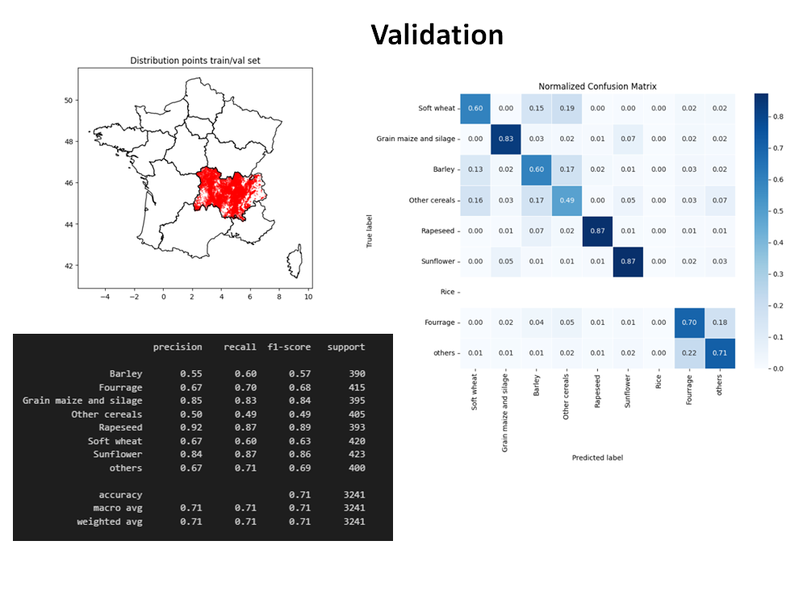
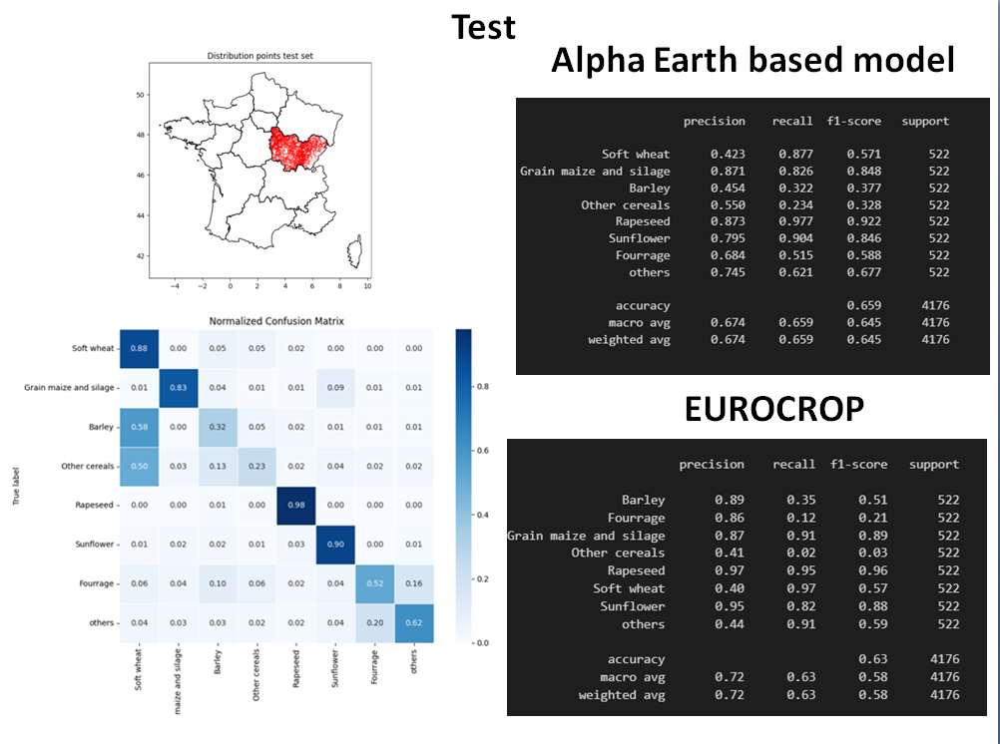
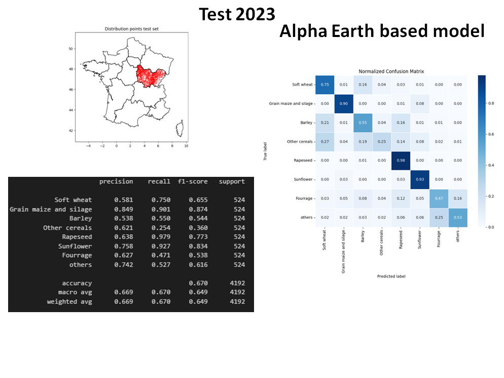
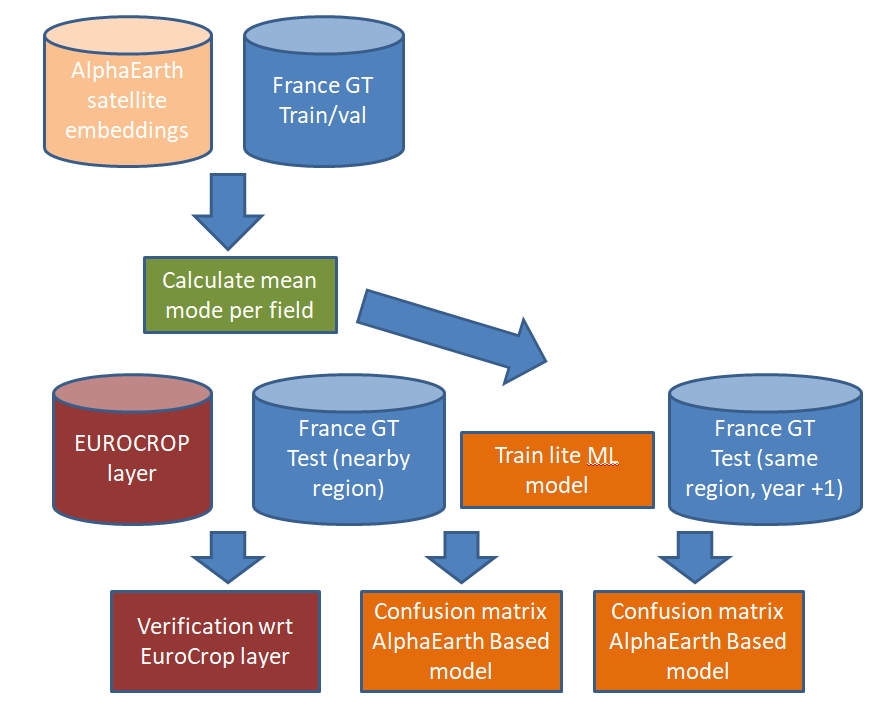

**POC Crop type detection**

The objective of the crop_type_detection.ipynb notebook is to demonstrate the feasibility of identifying annual crop types at the parcel level using satellite-based Earth embeddings. This proof-of-concept (POC) evaluates whether such embeddings can serve as reliable predictors for crop classification tasks traditionally based on national agricultural reference datasets.

**Data Sources and Experimental Design**

Training and Validation Data:
Parcels from the Registre Parcellaire Graphique (RPG) of France for the Auvergne–Rhône-Alpes region (year 2022) were used to construct the training and validation sets.

Test Data:
The primary test set consisted of RPG parcels from Bourgogne–Franche-Comté (year 2022), enabling spatial generalization assessment.

Feature Extraction:
For each parcel, a mean spectral embedding (“mean embedding”) was derived from the Alpha Earth satellite embedding collection. These aggregated feature vectors served as inputs to a Random Forest classifier trained to predict the corresponding crop type.

**Results**

Validation Performance:
The model achieved solid performance on the validation set, as illustrated in the following figure:

Primary Test Performance (Bourgogne–Franche-Comté, 2022):
Results on the independent test region showed an overall precision of approximately 70%, confirming that the embedding-based model generalizes beyond the training region.

Comparison with EUROCROP 2022:
To contextualize these results, predictions were compared with those derived from EUROCROP 2022, after harmonizing crop codes with the French RPG classification system.

EUROCROP achieved higher precision for certain classes,

whereas the embedding-based approach exhibited higher recall and F1-scores,
indicating a more balanced performance and lower omission rates.

**Temporal Generalization (2022 → 2023)**

To assess temporal robustness, the model trained on 2022 labels was applied to RPG parcels from 2023. Performance remained comparable, demonstrating the method’s capacity to generalize across both space and time, even when trained on a relatively limited geographic area.

The results of this temporal transfer evaluation are shown below:

**End-to-End Workflow**

A summary of the full workflow—data selection, embedding extraction, model training, and evaluation—is shown in the following schematic:

